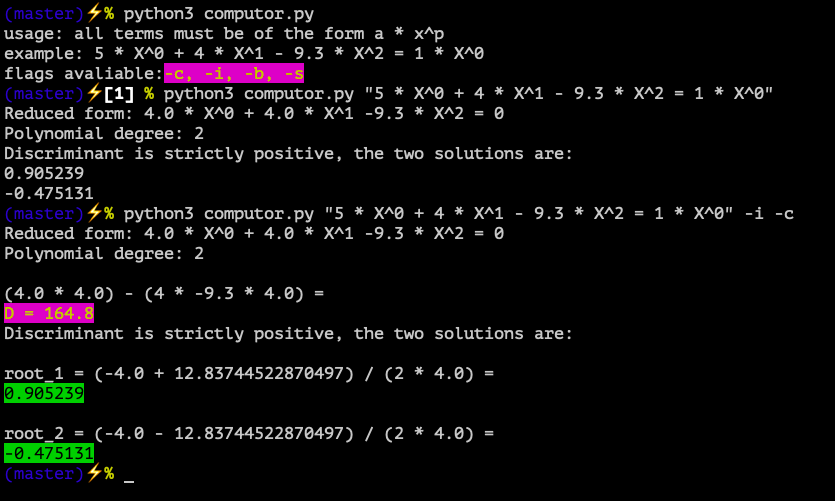

# Computor_v1

Install sympy for Python 3:
```
> pip3 install sympy
```

How to run:
``` python
> python3 computor.py "5 * X^0 + 4 * X^1 - 9.3 * X^2 = 1 * X^0"
```

Flags avaliable:
`-c` for color; `-i` for more information during calculations; 
`b` for displaing the output in browser; `-s` for fantastic sound at the end of calculations.

